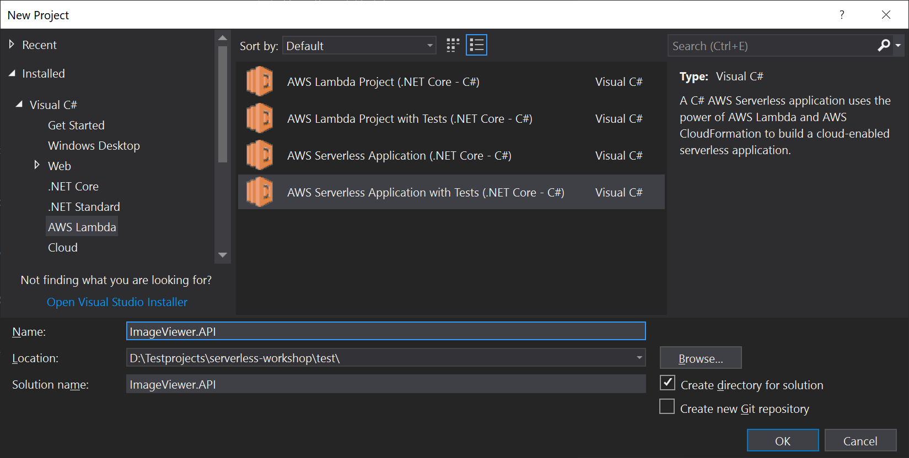
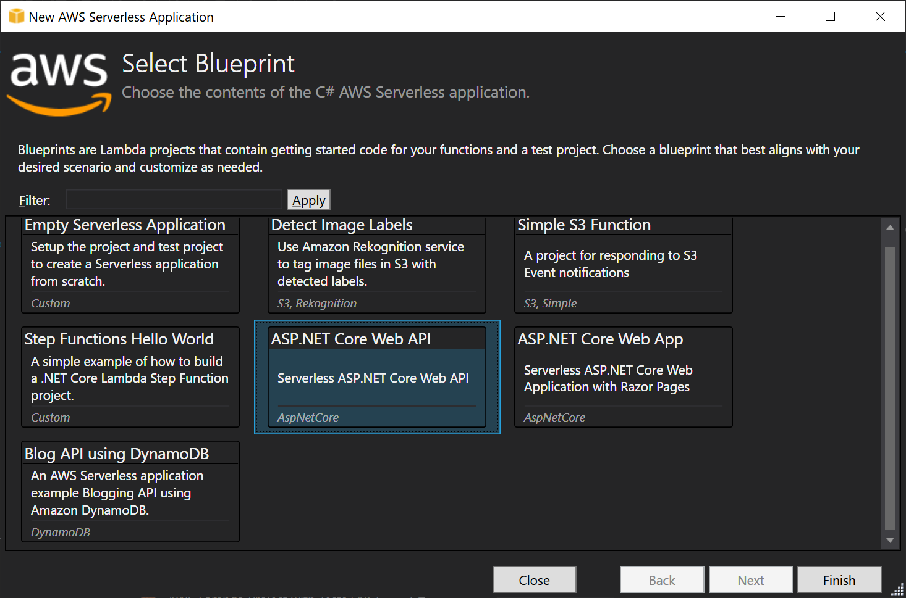
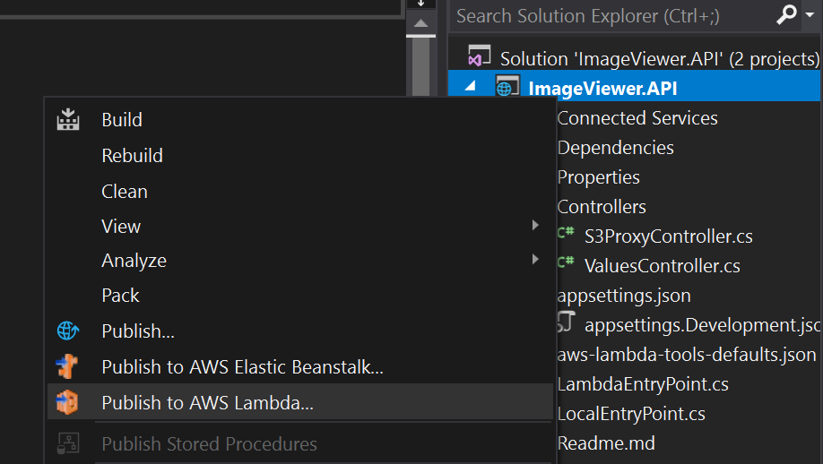
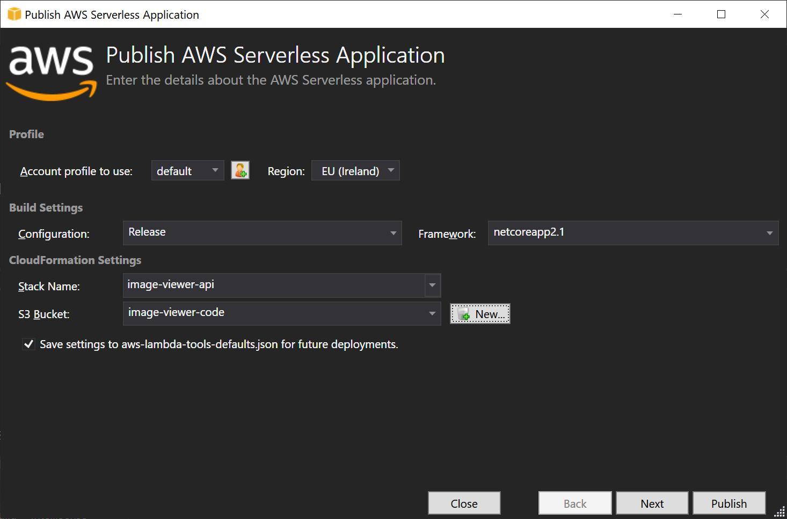
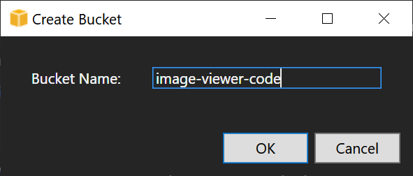
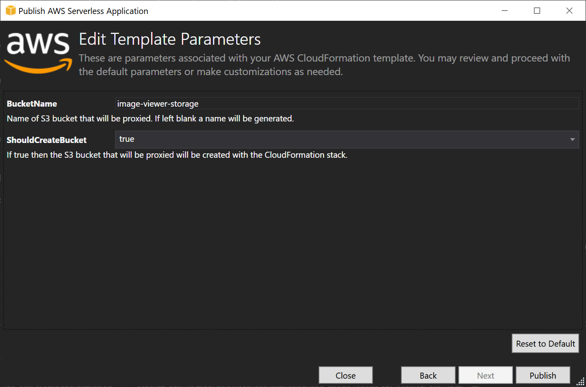
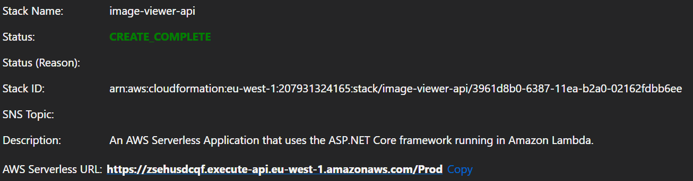
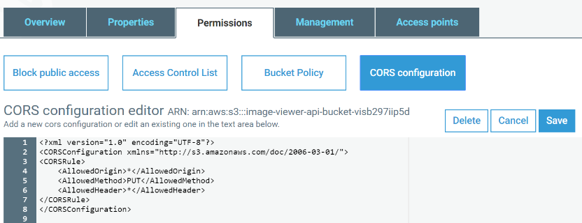

# Part 1 – Create Image Viewer API

## Create API poject

1. Open **Visual Studio** and create a new project **ImageViewer.API**

    

2. Select **AWS Serverless Application with Tests** and press **Finish**

    

3. Add an ability to upload images via S3. Add the following method to the **S3ProxyController**. This method generates a pre-signed url that will allow PUT request to S3 bucket.

    ```c#
        [HttpPost("startUpload")]
        public ActionResult StartUpload([FromBody]ImageInfo image)
        {
            try
            {
                var pre = new GetPreSignedUrlRequest
                {
                    BucketName = this.BucketName,
                    Key = image.Name,
                    ContentType = image.ContentType,
                    Verb = HttpVerb.PUT,
                    Expires = DateTime.UtcNow.AddDays(1)
                };

                var url = this.S3Client.GetPreSignedURL(pre);
                Logger.LogInformation($"Upload URL is generated for object {image.Name} to bucket {this.BucketName}.");
                return Ok(new { url });
            }
            catch (AmazonS3Exception e)
            {
                return BadRequest(e);
            }
        }
    ```

4. For **VS 2017**. Modify **Get** method to return image tags. Replace it with the code below

    ```c#
        [HttpGet]
        public async Task<JsonResult> Get()
        {
            var listResponse = await this.S3Client.ListObjectsV2Async(new ListObjectsV2Request
            {
                BucketName = this.BucketName
            });

            try
            {
                this.Response.ContentType = "text/json";
                List<ImageModel> images = new List<ImageModel>();
                foreach(var obj in listResponse.S3Objects)
                {
                    var getTagsResponse = await this.S3Client.GetObjectTaggingAsync(new GetObjectTaggingRequest
                    {
                        BucketName = this.BucketName,
                        Key = obj.Key
                    });
                    images.Add(new ImageModel
                    {
                        Key = obj.Key,
                        ETag = obj.ETag,
                        LastModified = obj.LastModified,
                        Size = obj.Size,
                        Tags = getTagsResponse.Tagging.Select(t => new ImageTag { Tag = t.Key, Value = t.Value })
                        .OrderByDescending(t => t.Value).ToList()
                    });
                }

                return new JsonResult(images, new JsonSerializerSettings { Formatting = Formatting.Indented,
                    ContractResolver = new CamelCasePropertyNamesContractResolver() });
            }
            catch(AmazonS3Exception e)
            {
                this.Response.StatusCode = (int)e.StatusCode;
                return new JsonResult(e.Message);
            }
        }
    ```

5. For **VS 2019**. Modify **Get** method to return image tags. Replace it with the code below

    ```c#
        [HttpGet]
        public async Task<JsonResult> Get()
        {
            var listResponse = await this.S3Client.ListObjectsV2Async(new ListObjectsV2Request
            {
                BucketName = this.BucketName
            });

            try
            {
                this.Response.ContentType = "text/json";
                List<ImageModel> images = new List<ImageModel>();
                foreach(var obj in listResponse.S3Objects)
                {
                    var getTagsResponse = await this.S3Client.GetObjectTaggingAsync(new GetObjectTaggingRequest
                    {
                        BucketName = this.BucketName,
                        Key = obj.Key
                    });
                    images.Add(new ImageModel
                    {
                        Key = obj.Key,
                        ETag = obj.ETag,
                        LastModified = obj.LastModified,
                        Size = obj.Size,
                        Tags = getTagsResponse.Tagging.Select(t => new ImageTag { Tag = t.Key, Value = t.Value })
                        .OrderByDescending(t => t.Value).ToList()
                    });
                }

                return new JsonResult(images);
            }
            catch(AmazonS3Exception e)
            {
                this.Response.StatusCode = (int)e.StatusCode;
                return new JsonResult(e.Message);
            }
        }
    ```

6. Add **ImageModel**. Create a new file Models/ImageModel.cs

    ```c#
    public class ImageModel
    {
        public string Key { get; set; }
        public long Size { get; set; }
        public DateTime LastModified { get; set; }
        public string ETag { get; set; }
        public List<ImageTag> Tags { get; set; }
    }

    public class ImageTag
    {
        public string Tag { get; set; }
        public string Value { get; set; }
    }
    ```

7. Add **ImageInfo**. Create a new file Models/ImageInfo.cs

    ```c#
    public class ImageInfo
    {
        public string Name { get; set; }
        public string ContentType { get; set; }
    }
    ```

8. Add missing references to the **S3ProxyController**

    ```c#
    using Microsoft.AspNetCore.Http;
    using ImageViewer.API.Models;
    using Newtonsoft.Json.Serialization;
    ```

9. Enter the S3 Bucket name **image-viewer-images** or similar unique name into **appsettings.json** file as **AppS3Bucket** value. This bucket will store images.
10. Build the project. Check that it compiled without errors.

## Deploy API Project to AWS

1. Select **Publish to AWS Lambda...** option in the project menu

    

2. In the opened dialog enter **Stack Name** for example **image-viewer-api**

    

3. Create a new S3 Bucket. Press the **New** button and come up with a unique bucket name, e.g. **image-viewer-code**. This bucket will be used for deployments. It will store archive with compiled binaries and CloudFormation template.

    

4. Press the **Next** button. In the new dialog enter the **BucketName** (from the **appsettings.json** file) where images will be stored.

    

5. Double check the used profile, region and other settings and press **Publish**.
6. Check publish status. Wait for the **CREATE_COMPLETE** state.

    

## Configure CORS for S3

1. Open **AWS Console** and go to the **S3** service
2. Open bucket with images
3. Navigate to **Permissions -> CORS configuration**

    

4. Enter the next configuration script and press **Save**

    ```xml
    <?xml version="1.0" encoding="UTF-8"?>
    <CORSConfiguration xmlns="http://s3.amazonaws.com/doc/2006-03-01/">
    <CORSRule>
        <AllowedOrigin>*</AllowedOrigin>
        <AllowedMethod>PUT</AllowedMethod>
        <AllowedHeader>*</AllowedHeader>
    </CORSRule>
    </CORSConfiguration>
    ```

5. Test that APIs are working.

    - Upload test image to S3. Open **AWS Management Console** and go to the **S3** service.
    - Select the created bucket for images. Press **Upload** and choose any image on your computer.
    - Look at the stack outputs in the Visual Studio and grab the created API’s url. Copy **AWS Serverless URL** value, add **/api/s3proxy/** suffix to it and call. For example, <https://x8tvwsuzlj.execute-api.eu-west-1.amazonaws.com/Prod/api/s3proxy/>
    - The request should return the list of uploaded S3 images.

Great, we have working APIs, then we need to secure them [Part 2 – Secure your application](../part2/part.md)
