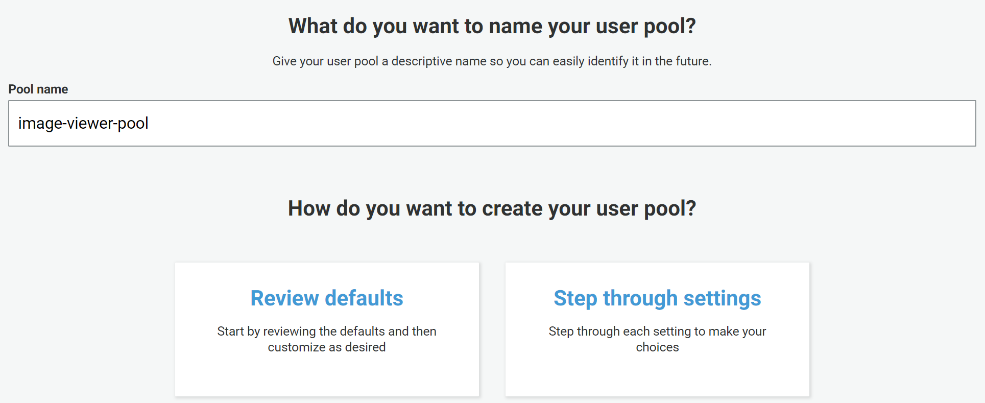
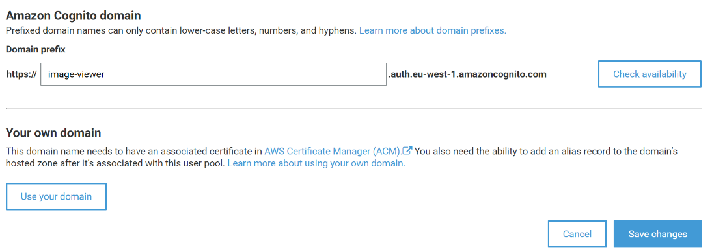
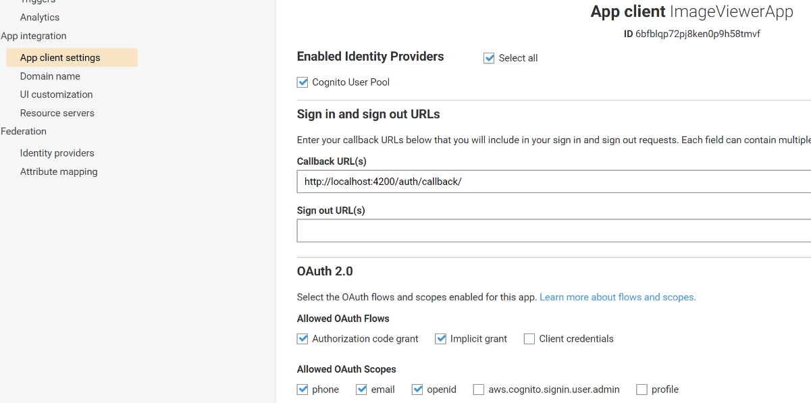
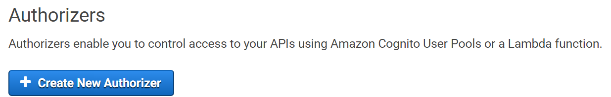
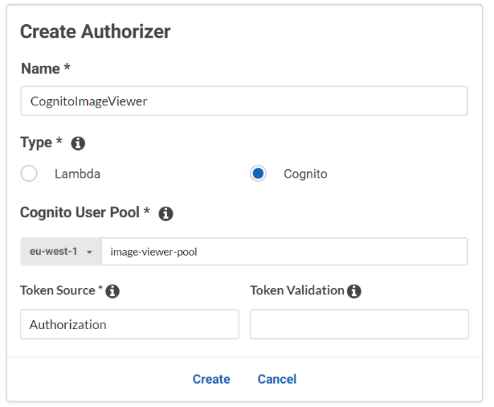
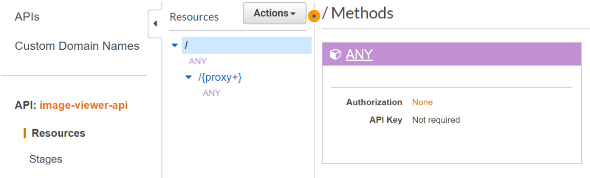
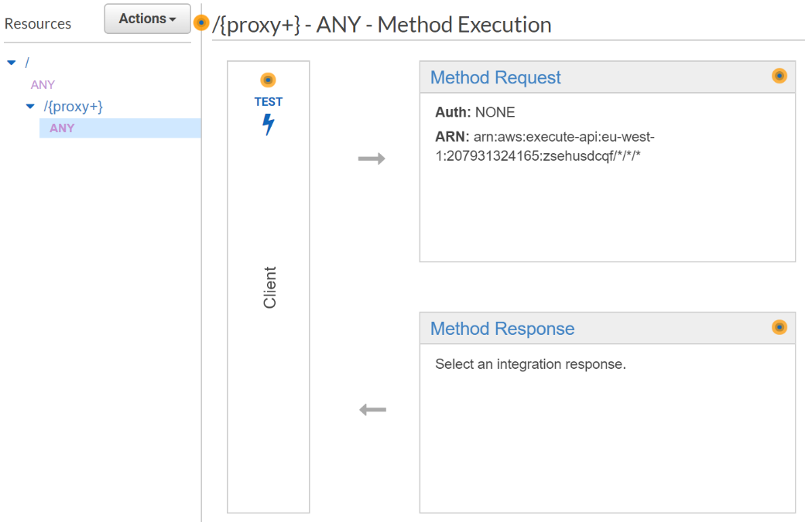
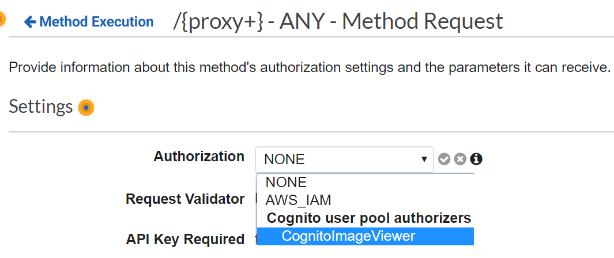
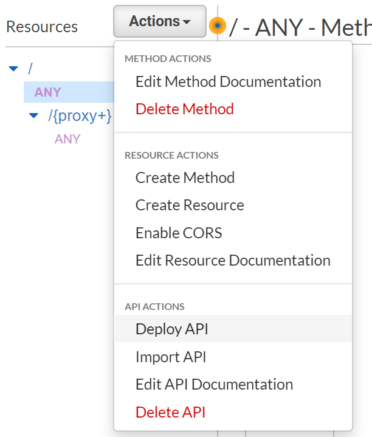
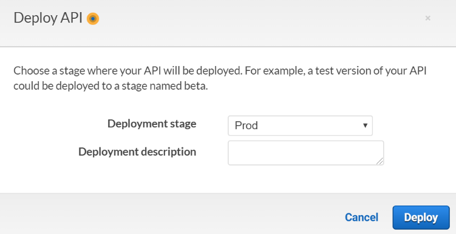

# Part 2 – Secure your application

## Create a Cognito User Pool

1. Create a new Cognito User Pool by navigating to Cognito in the AWS Console and choose Manage User Pools
2. Press Create a user pool button
3. User Pool Name Screen:

    

    - Enter a user pool name.
    - Click **Review defaults**
    - Leave everything by default and press Create pool

## Create an App Client

1. Select App clients tab
    - Press Add an app client
    - Name: ImageViewerApp
    - Generate Client secret - checked
2. Press Create client

## Create a Cognito Domain

1. Open the newly created pool and navigate to Domain name under App Integration menu
2. Enter domain image-viewer or similar name that is available.

    

3. Press Save changes.

## Configure App Client

1. Go to the App client settings under App integration section
2. Set the following settings
    - Enable Identity Providers – Select all
    - Callback URL(s) - <http://localhost:4200/auth/callback/>
    - Allowed OAuth Flows – Authorization code grant and Implicit grant
    - Allowed OAuth Scopes – phone, email, openid

     

## Add Cognito Authorizer

1. Go to the API Gateway service in the AWS Console.
2. Select Image Viewer API
3. Go to Authorizers and press Create New Authorizer

     

4. Enter the next settings
    - Name - any name, for ex. CognitoImageViewer
    - Type – Cognito
    - Cognito User Pool – select Image Viewer Pool
    - Token Source – Authorization
    - Token Validation – leave blank

     

5. And press Create

## Configure methods to use authorizer

1. Go to Resources

     

2. Select {proxy+} ANY Method

     

3. Refresh the web page in order to load new authorizers, just press F5. Then go to the Method Request settings
4. Select the corresponding Cognito authorizer and save changes.

     

5. Open Actions dropdown

     

6. Press Deploy API
7. Select Prod deployment stage and press Deploy

     

8. Wait 20-30 seconds and try to call API. For example <https://zsehusdcqf.execute-api.eu-west-1.amazonaws.com/Prod/api/s3proxy/>
9. The following unauthorized message should be responded.

    ~~~json
    {"message":"Unauthorized"}
    ~~~

The API now secured and available for requests with a valid Authorization header. The header must contain an id_token generated by Cognito.
