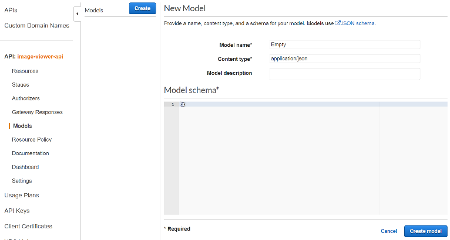
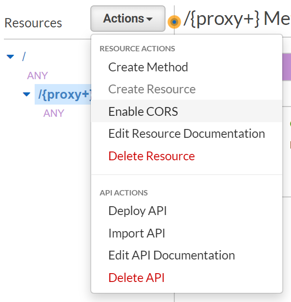
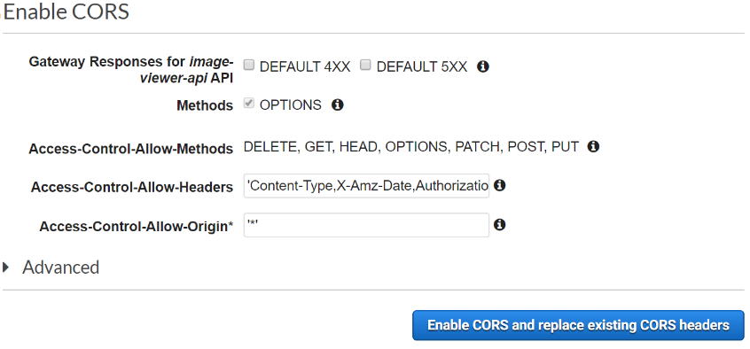
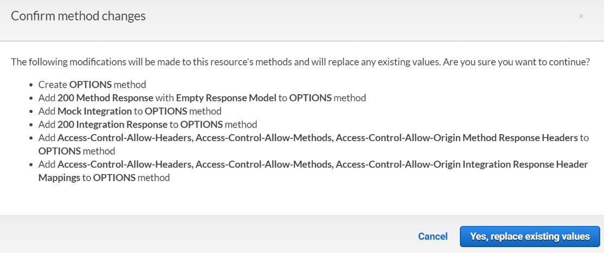
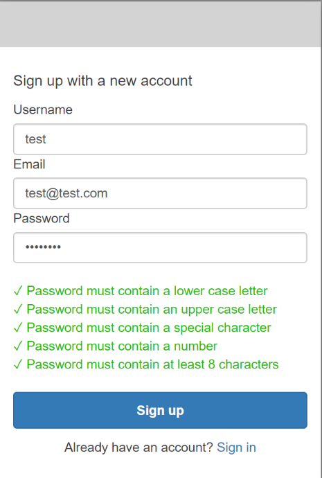
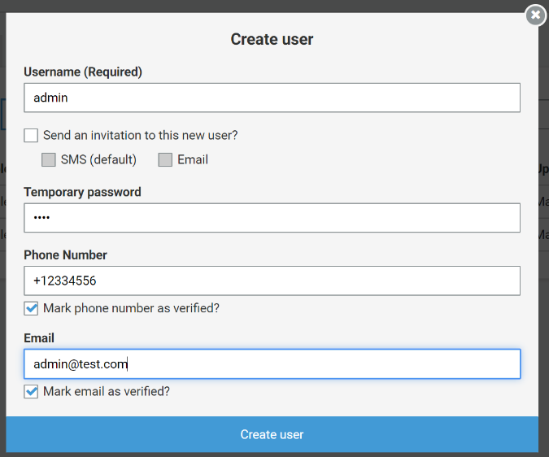
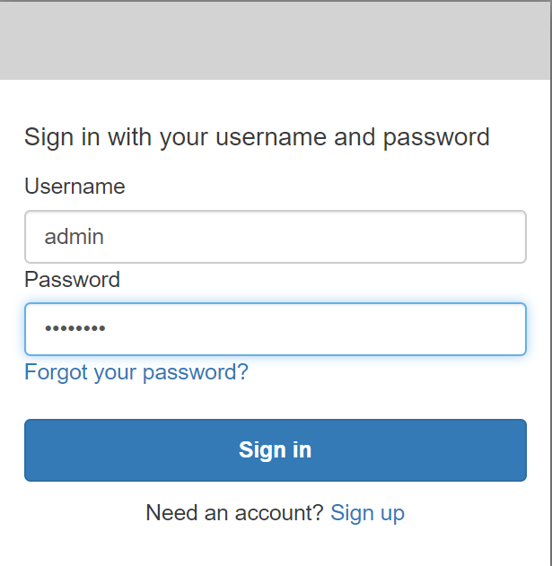

# Part 3 – Deploy Image Viewer Web application

## Create required infrastructure

1. Open **webapp\deploy.yml** file and examine it. Change Default value for **BucketName** parameter to some unique name.
2. Open command line in the **webapp** folder.
3. Prepare infrastructure for the **Image Viewer** web application using the next command. It will create **S3 Bucket** where web site files will be stored and a **CloudFront** distribution to open web site to the world.

    ~~~bash
    aws cloudformation deploy --force-upload --no-fail-on-empty-changeset --stack-name "image-viewer-web-app" --template-file deploy.yml
    ~~~

4. Open the **AWS Console**, go to the **CloudFormation** service. Wait until **image-viewer-web-app** stack will be in the completed state.
5. Examine outputs tab. Check the created **CloudFront domain**.

## Configure Web application

1. Open **webapp\build\assets\env\environment.values.js** file
2. Enter the next settings
    - **serverUrl** - the newly created **Image Viewer API**, for example, <https://x8tvwsuzlj.execute-api.eu-west-1.amazonaws.com/Prod/api/s3proxy/>
    - **authUrl** –  go to the **Cognito User Pool** and get **Domain URL** plus add **oauth2/** suffix. For example <https://test-image.auth.eu-west-1.amazoncognito.com/oauth2/>
    - **clientId** – go to the **Cognito User Pool -> General settings -> App clients** and get **App client id**
    - **clientSecret** - go to **Cognito User Pool -> General settings -> App clients** and get **App client secret**
    - **redirectUrl** – put URL to the CloudFront with **/auth/callback/** suffix, for ex. <https://d11slzr9srg2n2.cloudfront.net/auth/callback/>
3. Deploy files to **S3** using the next command

    ~~~bash
    aws s3 sync --cache-control 'no-cache' build/ s3://image-viewer-web-app/Deploy/build
    ~~~

4. Go to the **Cognito User Pool** and configure **App client settings**. Add an additional **Callback URL(s)** after comma (,) wich will point to the CloudFront distribution, for ex. <https://d11slzr9srg2n2.cloudfront.net/auth/callback/>

## Configure CORS for Image Viewer API

1. Open **ImageViewer.Api** project in the VisualStudio
2. Add the following lines to the **appsettings.json** file

    ~~~json
    "WebappRedirectUrl": "",
    "AdditionalCorsOrigins": "http://localhost:4200"
    ~~~

3. Change **WebappRedirectUrl** value to the created **CloudFront URL**, for ex. <https://d11slzr9srg2n2.cloudfront.net>
4. Open the **Startup** file and add **CORS** configuration
    - Add private const

        ~~~c#
        private const string CorsPolicyName = "CorsPolicy";
        ~~~

    - In the **ConfigureServices** method add a few lines to use allowed origins

        ~~~c#
        string[] corsOrigins = {
            Configuration.GetSection("WebappRedirectUrl").Value,
            Configuration.GetSection("AdditionalCorsOrigins").Value,
        };
        services.AddCors(options =>
        {
            options.AddPolicy(
                CorsPolicyName,
                builder => builder.WithOrigins(corsOrigins.Where(co => !stringIsNullOrEmpty(co)).ToArray())
                    .AllowAnyMethod()
                    .AllowAnyHeader()
                    .AllowCredentials()
                    .WithExposedHeaders("Content-Disposition"));
        });
        ~~~

    - In the **Configure** method

        ~~~c#
        app.UseCors(CorsPolicyName);
        ~~~

5. **Publish** the new version of the API.

## Configure CORS for API Gateway

1. Open **AWS Console** and go to the **API Gateway**, select **Models** and create an **Empty** model.

     

2. Go to the **Resources** tab. Select **{proxy+}** method, then expand **Actions** dropdown and press **Enable CORS**.

     

3. Leave everything by default and press **Enable CORS**

     

4. Confirm new settings

     

5. Open **Actions** dropdown and press **Deploy API**.

## Access Image Viewer web application

There are two options how to get access to the **Image Viewer** application

- Use real email and  **Sign-up** into the application. You need real email in order to enter verification code during the sign-up process.
- Or create a test user in the Cognito user pool

1. **Sign-up** with real email

     

2. Create a **test user**

    - Open **image-viewer-pool** Cognito User Pool
    - Select **Users and groups** tab
    - Press **Create user** button
    - Fill the form and press **Create** user

     

3. Sign in with a new user

     

4. Change password if needed.

## Open Image Viewer application

1. Open **CloudFront URL** in the browser. Enter any email\password combination and press **Login**, then you will be redirected to the **Cognito login page**.

2. Use created user to **Sign in**

3. Check that **Image Viewer** application works. Try to upload new images.

The **Image Viewer** web site is ready now. You can use it to manage your images. Additionaly, you can add labels in order to see what is displayed on each image. Follow the instructions from the next part [Part 4 – Add Image Viewer labeling function](../part4/part.md).
