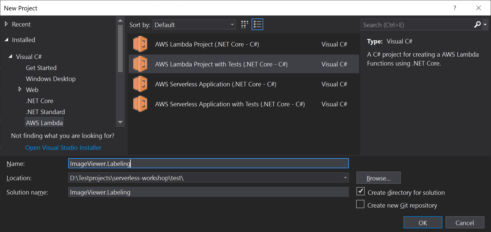

# Part 4 – Add Image Viewer labeling function

1. Open Visual Studio and create a new project

     

2. Choose **AWS Lambda Project with Tests**

     

3. Build project and check that build has no errors
4. Open **Publish to AWS Lambda...** dialog

     

5. Enter **Function Name** and press **Next**

     

6. Choose new role base on **AWSLambdaFullAccess** policy and press **Upload**

## Configure S3 Trigger

1. Open **AWS Console** and go to the **Lambda** service.
2. Select **image-viewer-labeling** lambda function.
3. Press **Add Trigger** button.
4. Select **S3** and fill required parameters, then press **Add**
    - **Bucket** – select bucket with images
    - **Event type** – All object create events

     

## Add permissions to call AWS Rekognition service

1. Scroll to the Lambda **Execution Role** section and press **View the .. role** on the IAM console.

     

2. Add a new policy to it, press **Attach policies**

     

3. Select **AWSRekognitionFullAccess**

     

4. Press **Attach** policy

5. Try to label new images.
    - Open the Image Viewer web application and upload new image.
    - Find new image in the table and examine created tags for it.

**Congrats!** You have completed the workshop! Do not forget to remove created resources. Follow instructions from the [Part 5 – Clean-up resources](../part5/part.md) section.
